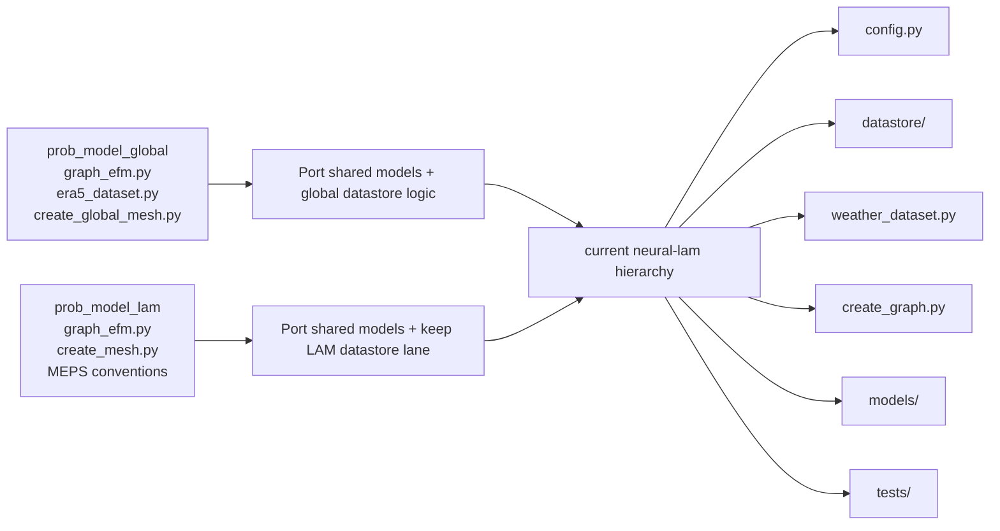
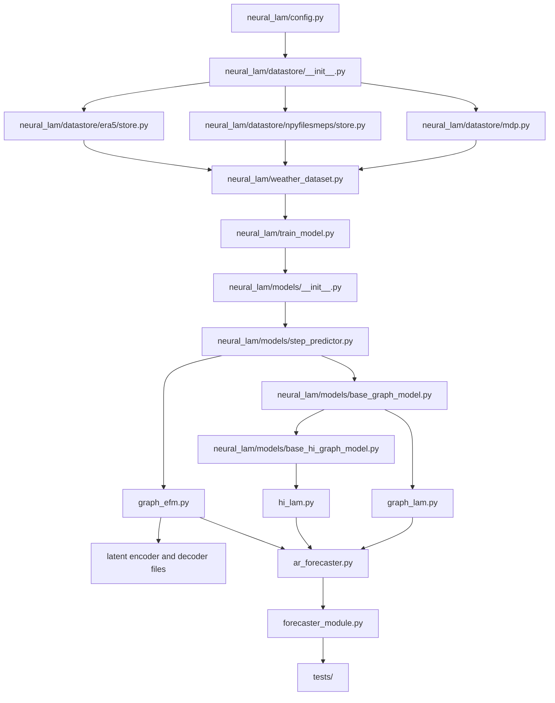

# GSoC Proposal: Merge `prob_model_global` And `prob_model_lam` Into The Current `neural-lam` Hierarchy

## Scope

This document is now written against the **current repo hierarchy** in:

- `d:\Agentic AI Projects\neural-lam`

The earlier folders are treated as donor branches that must merge **into this hierarchy**, not replace it:

- `D:\neural-lam` on branch `prob_model_global`
- `D:\neural-lam-2\neural-lam` on branch `prob_model_lam`

## Current Target Hierarchy Read For This Proposal

I based this final merge plan on the current repo files below:

- `README.md`
- `neural_lam/config.py`
- `neural_lam/create_graph.py`
- `neural_lam/weather_dataset.py`
- `neural_lam/train_model.py`
- `neural_lam/metrics.py`
- `neural_lam/vis.py`
- `neural_lam/models/__init__.py`
- `neural_lam/models/step_predictor.py`
- `neural_lam/models/ar_forecaster.py`
- `neural_lam/models/forecaster.py`
- `neural_lam/models/forecaster_module.py`
- `neural_lam/models/graph_lam.py`
- `neural_lam/models/hi_lam.py`
- `neural_lam/datastore/__init__.py`
- `neural_lam/datastore/base.py`
- `neural_lam/datastore/mdp.py`
- `neural_lam/datastore/npyfilesmeps/store.py`
- `tests/test_prediction_model_classes.py`
- `tests/test_training.py`
- `tests/test_graph_creation.py`

## Executive Summary

The right final destination is the **current repository structure**.

The old probabilistic branches should not be merged by copying their top-level layout. Instead:

1. Keep the current package hierarchy in `d:\Agentic AI Projects\neural-lam`.
2. Port the shared probabilistic model files into `neural_lam/models/`.
3. Add the global data path as a new datastore lane under `neural_lam/datastore/`.
4. Extend the existing training path built around `StepPredictor`, `ARForecaster`, and `ForecasterModule`.
5. Keep graph generation, plotting, tests, and CLI centered on the files that already exist in this repo.

## Why This Current Hierarchy Is The Correct Final Landing

The current repo already has the right abstractions:

- `neural_lam/config.py` provides config-driven execution
- `neural_lam/datastore/base.py` already supports `is_forecast` and `is_ensemble`
- `neural_lam/weather_dataset.py` already handles forecast-style and analysis-style datastores
- `neural_lam/create_graph.py` is already the graph-generation entry point
- `neural_lam/models/step_predictor.py` defines the predictor interface
- `neural_lam/models/ar_forecaster.py` handles autoregressive rollout
- `neural_lam/models/forecaster_module.py` owns training, validation, testing, and logging
- `tests/` already covers graph creation, training, datasets, and model classes

So the merge should finish this architecture, not go back to the older branch layout.

## What The Old Branches Contribute

### Shared probabilistic model core

These files are the main reusable probabilistic contribution from both donor branches:

- `neural_lam/models/graph_efm.py`
- `neural_lam/models/base_latent_encoder.py`
- `neural_lam/models/base_graph_latent_decoder.py`
- `neural_lam/models/constant_latent_encoder.py`
- `neural_lam/models/graph_latent_encoder.py`
- `neural_lam/models/graph_latent_decoder.py`
- `neural_lam/models/hi_graph_latent_encoder.py`
- `neural_lam/models/hi_graph_latent_decoder.py`

### Global-specific donor logic

From `D:\neural-lam`, the final repo mainly needs:

- global ERA5 data handling from `neural_lam/era5_dataset.py`
- forecast export ideas from `neural_lam/forecast_to_xarr.py`
- spherical graph-generation logic from `create_global_mesh.py`
- global forcing and static feature logic from `create_global_forcing.py` and `create_global_grid_features.py`

### LAM-specific donor logic

From `D:\neural-lam-2\neural-lam`, the final repo mainly needs:

- the probabilistic LAM model path
- existing MEPS assumptions as reference for compatibility
- current LAM graph conventions from `create_mesh.py`
- current LAM plotting behavior from `plot_graph.py`

## Final Merge Principle

The earlier branches should merge into this repo using three rules:

### Rule 1: Keep the current repo structure

Keep these current files and directories as the permanent skeleton:

- `neural_lam/config.py`
- `neural_lam/datastore/`
- `neural_lam/create_graph.py`
- `neural_lam/weather_dataset.py`
- `neural_lam/train_model.py`
- `neural_lam/models/`
- `tests/`

### Rule 2: Add shared probabilistic files inside the existing hierarchy

The probabilistic merge should happen by adding files **inside** `neural_lam/models/`, not by reviving the donor branch shape.

### Rule 3: Put global support into `datastore/`, not into a second training stack

Because `BaseDatastore` and `WeatherDataset` already support forecast and ensemble data, the cleanest final landing for the global branch is a new datastore implementation under the existing `neural_lam/datastore/` hierarchy.

## Final Repo Map

### A. Existing current files to keep as-is structurally

- `d:\Agentic AI Projects\neural-lam\neural_lam\config.py`
- `d:\Agentic AI Projects\neural-lam\neural_lam\create_graph.py`
- `d:\Agentic AI Projects\neural-lam\neural_lam\weather_dataset.py`
- `d:\Agentic AI Projects\neural-lam\neural_lam\train_model.py`
- `d:\Agentic AI Projects\neural-lam\neural_lam\metrics.py`
- `d:\Agentic AI Projects\neural-lam\neural_lam\vis.py`
- `d:\Agentic AI Projects\neural-lam\neural_lam\models\step_predictor.py`
- `d:\Agentic AI Projects\neural-lam\neural_lam\models\ar_forecaster.py`
- `d:\Agentic AI Projects\neural-lam\neural_lam\models\forecaster.py`
- `d:\Agentic AI Projects\neural-lam\neural_lam\models\forecaster_module.py`
- `d:\Agentic AI Projects\neural-lam\neural_lam\models\graph_lam.py`
- `d:\Agentic AI Projects\neural-lam\neural_lam\models\hi_lam.py`
- `d:\Agentic AI Projects\neural-lam\neural_lam\models\hi_lam_parallel.py`
- `d:\Agentic AI Projects\neural-lam\neural_lam\datastore\__init__.py`
- `d:\Agentic AI Projects\neural-lam\neural_lam\datastore\base.py`
- `d:\Agentic AI Projects\neural-lam\neural_lam\datastore\mdp.py`
- `d:\Agentic AI Projects\neural-lam\neural_lam\datastore\npyfilesmeps\store.py`
- `d:\Agentic AI Projects\neural-lam\tests\test_prediction_model_classes.py`
- `d:\Agentic AI Projects\neural-lam\tests\test_training.py`
- `d:\Agentic AI Projects\neural-lam\tests\test_graph_creation.py`

### B. New files to add into this repo

### Shared probabilistic model files

- `d:\Agentic AI Projects\neural-lam\neural_lam\models\graph_efm.py`
- `d:\Agentic AI Projects\neural-lam\neural_lam\models\base_latent_encoder.py`
- `d:\Agentic AI Projects\neural-lam\neural_lam\models\base_graph_latent_decoder.py`
- `d:\Agentic AI Projects\neural-lam\neural_lam\models\constant_latent_encoder.py`
- `d:\Agentic AI Projects\neural-lam\neural_lam\models\graph_latent_encoder.py`
- `d:\Agentic AI Projects\neural-lam\neural_lam\models\graph_latent_decoder.py`
- `d:\Agentic AI Projects\neural-lam\neural_lam\models\hi_graph_latent_encoder.py`
- `d:\Agentic AI Projects\neural-lam\neural_lam\models\hi_graph_latent_decoder.py`

### Global datastore lane

The cleanest final landing here is inferred from the current datastore layout:

- `d:\Agentic AI Projects\neural-lam\neural_lam\datastore\era5\__init__.py` (inferred)
- `d:\Agentic AI Projects\neural-lam\neural_lam\datastore\era5\config.py` (inferred)
- `d:\Agentic AI Projects\neural-lam\neural_lam\datastore\era5\store.py` (inferred)

### Optional utility if forecast export stays standalone

- `d:\Agentic AI Projects\neural-lam\neural_lam\forecast_to_xarr.py`

### C. Current files to extend

- `d:\Agentic AI Projects\neural-lam\neural_lam\models\__init__.py`
- `d:\Agentic AI Projects\neural-lam\neural_lam\train_model.py`
- `d:\Agentic AI Projects\neural-lam\neural_lam\models\forecaster_module.py`
- `d:\Agentic AI Projects\neural-lam\neural_lam\models\ar_forecaster.py`
- `d:\Agentic AI Projects\neural-lam\neural_lam\metrics.py`
- `d:\Agentic AI Projects\neural-lam\neural_lam\vis.py`
- `d:\Agentic AI Projects\neural-lam\neural_lam\create_graph.py`
- `d:\Agentic AI Projects\neural-lam\neural_lam\plot_graph.py`
- `d:\Agentic AI Projects\neural-lam\neural_lam\datastore\__init__.py`
- `d:\Agentic AI Projects\neural-lam\tests\test_prediction_model_classes.py`
- `d:\Agentic AI Projects\neural-lam\tests\test_training.py`
- `d:\Agentic AI Projects\neural-lam\tests\test_graph_creation.py`
- `d:\Agentic AI Projects\neural-lam\tests\test_datasets.py`
- `d:\Agentic AI Projects\neural-lam\tests\test_datastores.py`

### D. Donor files that should stay reference-only

These older files are useful as sources, but they should not become the final main structure in this repo:

- `D:\neural-lam\train_model.py`
- `D:\neural-lam-2\neural-lam\train_model.py`
- `D:\neural-lam\create_global_mesh.py`
- `D:\neural-lam-2\neural-lam\create_mesh.py`
- `D:\neural-lam\create_global_grid_features.py`
- `D:\neural-lam-2\neural-lam\create_grid_features.py`
- `D:\neural-lam\create_global_forcing.py`
- `D:\neural-lam-2\neural-lam\create_parameter_weights.py`
- `D:\neural-lam\neural_lam\era5_dataset.py`
- `D:\neural-lam-2\neural-lam\neural_lam\weather_dataset.py`
- `D:\neural-lam\neural_lam\models\ar_model.py`
- `D:\neural-lam-2\neural-lam\neural_lam\models\ar_model.py`

## Exact Merge Mapping Into The Current Hierarchy

| Donor file | Final landing in this repo |
| --- | --- |
| `D:\neural-lam\neural_lam\models\graph_efm.py` | `neural_lam/models/graph_efm.py` |
| `D:\neural-lam\neural_lam\models\graph_latent_encoder.py` | `neural_lam/models/graph_latent_encoder.py` |
| `D:\neural-lam\neural_lam\models\graph_latent_decoder.py` | `neural_lam/models/graph_latent_decoder.py` |
| `D:\neural-lam\neural_lam\models\hi_graph_latent_encoder.py` | `neural_lam/models/hi_graph_latent_encoder.py` |
| `D:\neural-lam\neural_lam\models\hi_graph_latent_decoder.py` | `neural_lam/models/hi_graph_latent_decoder.py` |
| `D:\neural-lam\neural_lam\models\constant_latent_encoder.py` | `neural_lam/models/constant_latent_encoder.py` |
| `D:\neural-lam\neural_lam\models\base_latent_encoder.py` | `neural_lam/models/base_latent_encoder.py` |
| `D:\neural-lam\neural_lam\models\base_graph_latent_decoder.py` | `neural_lam/models/base_graph_latent_decoder.py` |
| `D:\neural-lam\neural_lam\era5_dataset.py` | `neural_lam/datastore/era5/store.py` (adapted, inferred) |
| `D:\neural-lam\neural_lam\forecast_to_xarr.py` | `neural_lam/forecast_to_xarr.py` or `neural_lam/datastore/era5/` utility |
| `D:\neural-lam\create_global_mesh.py` | logic folded into `neural_lam/create_graph.py` |
| `D:\neural-lam\plot_global_graph.py` | logic folded into `neural_lam/plot_graph.py` |
| `D:\neural-lam-2\neural-lam\neural_lam\models\graphcast.py` | no new file, aligns with current `neural_lam/models/graph_lam.py` |
| `D:\neural-lam-2\neural-lam\neural_lam\models\graph_fm.py` | no new file, aligns with current `neural_lam/models/hi_lam.py` |
| `D:\neural-lam-2\neural-lam\create_mesh.py` | reference for extending `neural_lam/create_graph.py` |
| `D:\neural-lam-2\neural-lam\plot_graph.py` | reference for extending `neural_lam/plot_graph.py` |

## Diagram: Donor Branches Into Current Repo

## Diagram: Final Repo After Merge

My Propsal for issue 49  Will not Create any issue as the CNN Predictor ,ARForecasterSmapler and EnsembleForecasterModule will be separate files we just have to modify the training script or adda separate script to use the files to train

